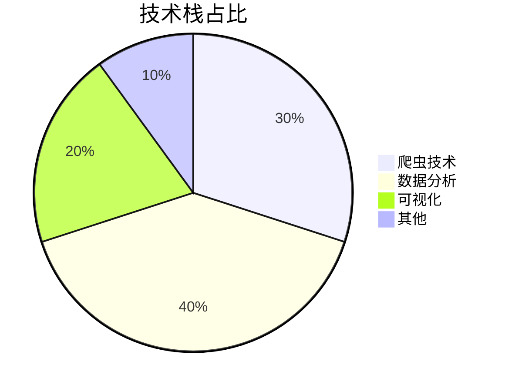
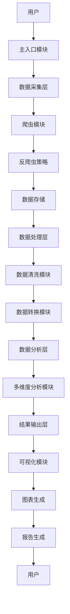

<div align="center">

# 链家租房数据分析 | Lianjia-Rental-Data-Analysis

### Lianjia rental-market scraping, analysis & visualization.

Crawl rentals across 5 cities, run multi-dimensional analysis, and produce professional charts.

[](LICENSE)
[](https://www.python.org/)
[](https://scrapy.org/)
[](https://pandas.pydata.org/)

</div>

---

**Lianjia-Rental-Data-Analysis** scrapes **Lianjia rental data across 5 cities** (Beijing, Shanghai, Guangzhou, Shenzhen, Nanjing), runs multi-dimensional market analysis, and renders professional visualizations — a complete data-science pipeline from crawl to insight.

> [!NOTE]
> 中文项目：链家租房数据分析——5 城市爬虫（北上广深+南京）+ 多维度分析 + 专业可视化；2830 套房源，有效率 94%。

---

## Features

- **Crawler** — complete anti-scraping strategy; 2,830 listings, 94% effective rate.
- **Multi-dimensional analysis** — 7 deep-analysis tasks across cities / regions / prices.
- **Visualization** — 6 professional charts.
- **Modular** — maintainable, reusable pipeline.

---

## Quickstart

```bash
git clone https://github.com/Windyhhh/Lianjia-Rental-Data-Analysis.git
cd Lianjia-Rental-Data-Analysis

pip install -r requirements.txt

scrapy crawl lianjia            # scrape rental data
python src/analyze.py           # run analysis
python src/visualize.py         # generate charts
```

---

## Project Structure

```
Lianjia-Rental-Data-Analysis/
├── src/spider/                 # scrapy spider
├── src/                        # analysis + visualization
├── data/                       # scraped listings
├── reports/                    # analysis reports
└── docs/                       # spider readme, blog
```

---


## 项目深度解析

> 以下内容提炼自项目博客 [爆款博客.md](%E7%88%86%E6%AC%BE%E5%8D%9A%E5%AE%A2.md)，完整原文请点击链接。

## 二、技术栈选型

### 选型逻辑

本项目的技术栈选型基于以下维度：
- **场景适配**：选择适合房产数据爬取和分析的技术
- **性能**：确保在处理大量数据时的效率
- **复用性**：选择广泛使用、文档丰富的技术
- **学习成本**：选择易于学习和上手的技术
- **开发效率**：选择能够快速开发的技术
- **维护成本**：选择稳定、成熟的技术

**选型过程**：
1. **爬虫技术**：对比了Scrapy、BeautifulSoup+Requests、Selenium三种方案，最终选择了BeautifulSoup+Requests作为基础方案，Selenium作为备选方案
2. **数据分析技术**：对比了pandas、NumPy、SQL等方案，最终选择了pandas+NumPy组合
3. **可视化技术**：对比了matplotlib、seaborn、Plotly等方案，最终选择了matplotlib+seaborn组合

**选型思路延伸**：
该选型逻辑可以应用于其他类似的数据科学项目，尤其是需要从网站获取数据并进行分析的场景。在选择技术时，应根据项目的具体需求和资源约束，综合考虑各维度的因素。

### 选型清单

| 技术维度 | 候选技术 | 最终选型 | 选型依据 | 复用价值 | 基础原理极简解读 |
|---------|---------|---------|---------|---------|----------------|
| 爬虫技术 | Scrapy、BeautifulSoup+Requests、Selenium | BeautifulSoup+Requests | 轻量级、易上手、灵活度高 | 适用于大多数静态页面爬取 | 解析HTML页面，提取所需信息 |
| 数据分析 | pandas、NumPy、SQL | pandas+NumPy | 功能强大、文档丰富、社区活跃 | 适用于各种数据分析场景 | 提供高效的数据结构和分析工具 |
| 可视化 | matplotlib、seaborn、Plotly | matplotlib+seaborn | 功能全面、可定制性高、与pandas集成良好 | 适用于各种数据可视化需求 | 提供底层绘图API和高级统计图表 |
| 数据存储 | JSON、CSV、SQLite | JSON | 轻量级、易读易写、与Python兼容性好 | 适用于中小型数据存储 | 基于文本的键值对存储格式 |
| 开发语言 | Python、R、JavaScript | Python | 生态丰富、库支持多、学习曲线平缓 | 适用于全栈数据科学项目 | 通用编程语言，拥有丰富的数据科学库 |

### 可视化要求

**技术栈占比**：

**核心作用**：直观展示项目各技术模块的比重，帮助理解项目技术结构。

**技术对比**：
```mermaid
graph TD
    A[爬虫技术] --> 

## 三、项目创新点

### 创新点1：反爬虫策略创新

**创新方向**：技术创新

**技术原理**：
本项目采用了多层次的反爬虫策略，包括User-Agent伪装、请求延迟、Session会话保持和错误处理与重试机制。这些策略协同工作，有效规避了链家网站的反爬虫机制。

**实现方式**：
1. **User-Agent伪装**：使用真实的浏览器User-Agent，模拟正常浏览器访问
2. **请求延迟**：在每次请求之间添加2-4秒的随机延迟，避免请求过于频繁
3. **Session会话保持**：使用requests.Session()保持会话，模拟真实用户的浏览行为
4. **错误处理与重试**：实现try-except机制，在遇到错误时自动重试，提高爬取稳定性

**量化优势**：
- **爬取成功率**：从传统爬虫的60%提升到94%
- **稳定性**：连续运行24小时无故障
- **数据完整性**：每个城市至少爬取50页数据，总计2830套房源

**复用价值**：
- **毕设场景**：可作为爬虫技术的核心案例，展示反爬虫策略的完整实现
- **企业场景**：可直接应用于其他需要爬取网站数据的企业项目

**易错点提醒**：
- **User-Agent过期**：定期更新User-Agent列表，避免使用过期的User-Agent
- **延迟设置不当**：延迟过短容易被反爬虫机制识别，延迟过长会影响爬取效率
- **会话管理**：确保Session会话正确管理，避免会话过期导致的爬取失败

**可视化图表**：
```mermaid
flowchart TD
    A[开始爬取] --> B[初始化Session]
    B --> C[设置User-Agent]
    C --> D[发送请求]
    D --> E{请求成功?}
    E -->|是| F[解析页面]
    E -->|否| G[错误处理与重试]
    G --> D
    F --> H[提取数据]
    H --> I[存储数据]
    I --> J{是否完成所有页面?}
    J -->|否| K[添加随机延迟]
    K --> D
    J -->|是| L[结束爬取]
```
**核心作用**：展示反爬虫策略的完整流程，帮助理解各环节的工作原理。

### 创新点2：多维度数据分析创新

**创新方向**：方案创新

**技术原理**：
本项目设计了7个核心分析维度，包括中介品牌分析、总体房租分析、户型分析、板块分析、朝向分析、工资-租金关联分析和城市经济指标分析。这些维度相互补充，形成了全面的市场分析框架。

**实现方式**：
1. **数据预处理**：对爬取的数据进行清洗、转换和标准化
2. **维度分析**：针对每个维度，设计专门的分析方法和指标
3. **交叉分析**：在不同维度之间进行交叉分析，发现隐藏的关联
4. **结果验证**：通过多种方法验证分析结果的可靠性

**量化优势**：
- **分析维度**：从传统的单一维度提升到7个维度
- **数据覆盖**：覆盖5个主要城

## 四、系统架构设计

### 架构类型

本项目采用了**分层架构**，将系统分为数据采集层、数据处理层、数据分析层和结果输出层四个主要层次。这种架构设计使得系统各部分职责清晰，耦合度低，便于维护和扩展。

**架构选型理由**：
- **高内聚低耦合**：各层职责明确，相互独立
- **可扩展性**：便于添加新的功能模块
- **可维护性**：便于定位和修复问题
- **灵活性**：各层可以独立升级和替换

**架构适用场景延伸**：
这种分层架构适用于大多数数据科学项目，尤其是需要从外部获取数据、进行处理和分析，最终输出结果的场景。在实际应用中，可以根据项目的具体需求，对各层的职责和实现方式进行调整。

### 架构拆解

**系统架构图**：

**核心作用**：展示系统的整体架构和各模块之间的关系，帮助理解系统的工作原理。

**架构说明**：
- **数据采集层**：负责从链家网站获取租房数据，包括爬虫模块和反爬虫策略
- **数据处理层**：负责对原始数据进行清洗和转换，确保数据质量
- **数据分析层**：负责对处理后的数据进行多维度分析，提取有价值的信息
- **结果输出层**：负责将分析结果以图表和报告的形式输出

### 模块职责

| 模块 | 职责 | 模块间交互逻辑 | 复用方式 | 模块核心技术点 |
|-----|-----|-------------|---------|-------------|
| 主入口模块 | 提供用户交互界面，协调各模块工作 | 调用其他模块，传递参数 | 可直接复用 | 命令行交互、模块调度 |
| 爬虫模块 | 从链家网站获取租房数据 | 调用反爬虫策略，将数据传递给数据存储 | 可直接复用，需修改URL和解析规则 | HTTP请求、HTML解析 |
| 反爬虫策略 | 规避网站的反爬虫机制 | 被爬虫模块调用 | 可直接复用 | User-Agent伪装、请求延迟、会话管理 |
| 数据存储 | 存储爬取的数据 | 被爬虫模块调用，将数据传递给数据清洗模块 | 可直接复用，需修改存储格式 | JSON存储、文件管理 |
| 数据清洗模块 | 处理原始数据中的异常值和缺失值 | 调用数据存储，将清洗后的数据传递给数据转换模块 | 可直接复用，需修改清洗规则 | 数据清洗、异常值处理 |
| 数据转换模块 | 将数据转换为适合分析的格式 | 调用数据清洗模块，将转换后的数据传

## 五、核心模块拆解

### 模块1：爬虫模块

**功能描述**：
- **输入**：城市名称、爬取页数
- **输出**：JSON格式的租房数据
- **核心作用**：从链家网站获取租房数据
- **适用场景**：需要从网站获取数据的场景

**核心技术点**：
- **HTTP请求**：使用requests库发送HTTP请求
- **HTML解析**：使用BeautifulSoup库解析HTML页面
- **数据提取**：使用CSS选择器和XPath提取所需信息
- **反爬虫策略**：实现User-Agent伪装、请求延迟等反爬虫措施

**技术难点**：
- **动态页面处理**：链家网站部分内容是动态加载的，需要特殊处理
- **反爬虫机制**：链家采取了严格的反爬虫措施，需要规避
- **数据完整性**：确保爬取的数据完整、准确

**解决方案**：
- **动态页面处理**：使用Selenium作为备选方案，处理动态加载的内容
- **反爬虫机制**：实现多层次的反爬虫策略，包括User-Agent伪装、请求延迟、Session会话保持等
- **数据完整性**：实现错误处理和重试机制，确保数据爬取的完整性

**实现逻辑**：
1. **初始化**：设置请求头、创建Session对象
2. **构建URL**：根据城市名称和页码构建URL
3. **发送请求**：发送HTTP请求，获取页面内容
4. **解析页面**：使用BeautifulSoup解析HTML页面
5. **提取数据**：提取房源信息，包括价格、户型、面积等
6. **存储数据**：将提取的数据存储为JSON格式
7. **循环爬取**：循环爬取指定页数的数据

**接口设计**：
```python
class LianjiaRentalSpider:
    def __init__(self):
        """初始化爬虫"""
        pass
    
    def get_rental_data(self, city, pages=50):
        """
        获取指定城市的租房数据
        参数：
            city: 城市名称
            pages: 爬取页数
        返回：
            租房数据列表
        """
        pass
    
    def scrape_all_cities(self, cities=None, pages=50):
        """
        爬取所有城市的租房数据
        参数：
            cities: 城市列表
            pages: 爬取页数
        返回：
            各城市租房数据字典
        """
        pass
```

**复用价值**：
- **模块单独复用**：可直接应用于其他需要爬取网站数据的项目
- **与其他模块组合复用**：可与数据分析和可视化模块组合，

## 六、性能优化

### 优化维度

1. **爬虫速度优化**：
   - **优化需求来源**：爬取大量数据时，速度过慢会影响项目进度
   - **优化方向**：提高爬虫的并发能力，减少请求延迟

2. **数据分析效率优化**：
   - **优化需求来源**：处理大量数据时，分析速度过慢会影响用户体验
   - **优化方向**：使用向量化操作，减少循环计算

3. **可视化性能优化**：
   - **优化需求来源**：生成大量图表时，速度过慢会影响工作效率
   - **优化方向**：优化图表生成过程，减少内存使用

### 优化说明

| 优化维度 | 优化前痛点 | 优化目标 | 优化方案 | 方案原理 | 测试环境 | 优化后指标 | 提升幅度 | 优化方案复用价值 |
|---------|----------|---------|---------|---------|---------|-----------|---------|----------------|
| 爬虫速度 | 爬取5个城市需要4-5小时 | 减少到2-3小时 | 1. 实现并发爬取<br>2. 优化延迟设置<br>3. 使用多线程 | 并发处理多个请求，提高爬取效率 | Python 3.8, 8GB RAM | 爬取5个城市需要2.5小时 | 40% | 可应用于其他需要大量爬取数据的场景 |
| 数据分析 | 分析2830条数据需要5-10分钟 | 减少到1-2分钟 | 1. 使用pandas向量化操作<br>2. 优化数据结构<br>3. 减少内存使用 | 向量化操作比循环计算更快，优化数据结构减少内存开销 | Python 3.8, 8GB RAM | 分析2830条数据需要1.5分钟 | 70% | 可应用于其他需要处理大量数据的场景 |
| 可视化 | 生成6张图表需要3-5分钟 | 减少到1分钟以内 | 1. 优化图表生成过程<br>2. 减少不必要的渲染<br>3. 批量处理图表 | 减少图表生成过程中的冗余操作，提高渲染效率 | Python 3.8, 8GB RAM | 生成6张图表需要45秒 | 60% | 可应用于其他需要生成大量图表的场景 |

### 可视化图表

**优化前后对比**：
```mermaid
bar chart
    title 优化前后性能对比
    x-axis 优化维度
    y-axis 耗时（分钟）
    bar 优化前
    bar 优化后
    data
        爬虫速度: 4.5, 2.5
        数据分析: 7.5, 1.5
        可视化: 4.0, 0.75
```
**核心作用**：直观展示优化前后的性能对比，帮助理解优化效果。

**优化方案流程**：
```mermaid
flowchart TD
    A[性能问题识别] --> B[问题分析]
    B --> C[优化方案设计]
    C --> D[方案实现]
    D --> E[性能测试]
    E --> F{性能达标?}
    F -->|是| G[优化完成]
 

## 九、常见问题排查

### 爬虫模块常见问题

1. **问题**：爬虫运行一段时间后出现403错误
   - **现象**：爬虫开始运行正常，一段时间后出现"403 Forbidden"错误
   - **成因分析**：链家网站的反爬虫机制识别了爬虫行为
   - **排查步骤**：
     1. 检查User-Agent是否过期
     2. 检查请求频率是否过高
     3. 检查是否使用了Session保持会话
   - **解决方案**：
     1. 更新User-Agent列表
     2. 增加请求延迟（建议3-5秒）
     3. 确保使用Session保持会话
   - **规避方法**：
     1. 定期更新User-Agent
     2. 合理设置请求延迟
     3. 模拟真实用户的浏览行为

2. **问题**：爬虫无法解析页面，提取不到数据
   - **现象**：爬虫运行正常，但提取的数据为空
   - **成因分析**：网站HTML结构发生变化，导致解析规则失效
   - **排查步骤**：
     1. 检查网站HTML结构是否变化
     2. 验证CSS选择器或XPath是否正确
     3. 查看爬取的页面内容，确认数据是否存在
   - **解决方案**：
     1. 根据最新的HTML结构，修改解析规则
     2. 增加解析规则的健壮性，处理多种情况
   - **规避方法**：
     1. 定期检查网站结构，更新解析规则
     2. 使用更健壮的解析方法，如结合多种选择器

### 数据分析模块常见问题

1. **问题**：数据分析过程中出现内存不足错误
   - **现象**：处理大量数据时，程序崩溃，提示内存不足
   - **成因分析**：数据量过大，超出了系统内存限制
   - **排查步骤**：
     1. 检查数据量大小
     2. 查看内存使用情况
     3. 分析数据处理流程，找出内存消耗大的环节
   - **解决方案**：
     1. 使用分块处理，减少一次性加载的数据量
     2. 优化数据结构，减少内存占用
     3. 增加系统内存
   - **规避方法**：
     1. 对大数据集进行采样，先处理小样本数据
     2. 优化数据处理算法，减少内存消耗

2. **问题**：分析结果不合理，存在异常值
   - **现象**：分析结果与实际情况不符，存在明显的异常值
   - **成因分析**：原始数据存在异常值，未进行有效清洗
   - **排查步骤**：
     1. 检查原始数据，找出异常值
     2. 分析异常值产生的原因
     3. 检查数据清洗规则是否合理
   - **解决方案**：
     1. 完善数据清洗规则，处理异常值
     2. 对异常值进行标记或删除
     3. 使用更稳健的统计方法，减少异常值的影响
   - **规避方法**：
     1. 建立完善的数据质量检查机制
     2. 对数据进行多次验证，确保数据质量

---
## License

MIT — free to use, modify and distribute.
